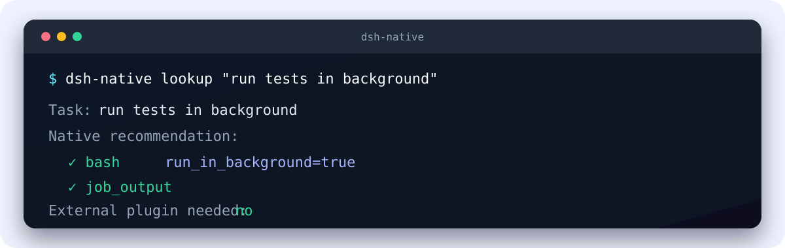

# dsh-native-playbook

**Use what DeepSeek Harness already ships before building more.**

[](https://github.com/cyanseek/dsh-native-playbook/actions/workflows/ci.yml)
[](./LICENSE)

`dsh-native-playbook` maps everyday tasks to built-in
[DeepSeek Harness](https://github.com/deepseek-ai/deepseek-harness) capabilities and checks
whether those capabilities are available in the current DSH profile.

> task → native capability → availability → recommended action

[简体中文](./README.zh-CN.md)



## Why

DSH already includes tools for files, shell commands, background jobs, code search,
subagents, workflows, goals, web access, sessions, and more. The difficult part is knowing
which capability fits a task and whether the active profile has everything it needs.

```text
Run tests in the background
→ bash(run_in_background=true) → job_output

Find every symbol reference
→ lsp → grep fallback when no LSP provider is ready

Let another agent investigate while I keep working
→ subagent → list_agents / send_message
```

## Highlights

- **Native-first recommendations** — check DSH before adding another plugin or workaround.
- **Real profile awareness** — distinguish ready, opt-in, disabled, and provider-dependent paths.
- **DSH runtime plugin** — expose the `native_capability` tool inside a DSH profile.
- **Agent Skill** — give Codex and compatible agents focused task recipes.
- **CLI and Node API** — use the same results in terminals, scripts, and integrations.
- **Offline by default** — static lookup has no telemetry and makes no install-time network request.

## Install

### DSH plugin

Install directly from GitHub into a DSH profile:

```bash
dsh plugin --profile web add github:cyanseek/dsh-native-playbook
```

Verify that the plugin is part of the profile:

```bash
dsh --profile web --dump-config
```

Remove it with:

```bash
dsh plugin --profile web remove dsh-native-playbook
```

Git-based installation builds the package from source. If pnpm asks you to approve the
package build, follow the command shown by pnpm and run the install again.

### Agent Skill

Install the Skill for Codex:

```bash
npx skills@latest add cyanseek/dsh-native-playbook \
  --skill dsh-native-playbook \
  --agent codex \
  --yes
```

For a shared project installation, the CLI can also copy the Skill into a DSH-compatible
Skill directory:

```bash
pnpm dsh-native install --target project
pnpm dsh-native install --target dsh
```

### CLI from a checkout

Requirements: Node.js 22 or 24 and pnpm 10 or later.

```bash
git clone https://github.com/cyanseek/dsh-native-playbook.git
cd dsh-native-playbook
corepack enable
pnpm install --frozen-lockfile
pnpm build

pnpm dsh-native lookup "run tests in background"
pnpm dsh-native status --profile web
```

The package is not yet published to npm. Use the GitHub or checkout routes above.

## Usage

Inside an installed DSH profile, ask naturally:

```text
Which native DSH capability should I use to run tests in the background?
```

The `native_capability` tool returns the native recommendation and current availability.

The CLI supports human-readable and JSON output:

```text
dsh-native lookup "<task>" [--profile <name>] [--json]
dsh-native status --profile <name> [--json]
dsh-native list [--profile <name>] [--json]
dsh-native explain <capability> [--profile <name>] [--json]
dsh-native doctor [--json]
dsh-native install --target project|dsh [--json]
```

Examples:

```bash
pnpm dsh-native lookup "find all symbol references" --json
pnpm dsh-native lookup "build a custom plugin for background jobs" --json
pnpm dsh-native explain subagent --profile headless
```

## Availability states

| State | Meaning |
| --- | --- |
| `ready` | The active profile can use the capability. |
| `platform-dependent` | Availability depends on the operating system. |
| `opt-in` | DSH provides it, but the profile has not enabled it. |
| `requires-provider` | The tool exists, but a provider is still required. |
| `disabled` | The capability is present but disabled in the profile. |

Package presence alone is never treated as proof that a capability is ready.

## Node API

```ts
import {
  inspectDshProfile,
  lookupNativeCapability,
} from 'dsh-native-playbook'

const profile = await inspectDshProfile({ profile: 'web' })
const result = await lookupNativeCapability('run a long test in background', { profile })
```

The public API includes `lookupNativeCapability`, `listNativeCapabilities`,
`explainNativeCapability`, `inspectDshProfile`, and `loadTaskMap`.

## Scope and compatibility

- This is a community DSH extension, not an official DeepSeek project.
- It covers native capability selection; it is not a third-party plugin marketplace.
- Static lookup works without DSH. Profile-aware status requires a working `dsh` command and
  an existing profile.
- Capability mappings are verified against a pinned revision of the official DSH source.
- No API function prompts, sends telemetry, or reads credentials.

## Development

```bash
pnpm install --frozen-lockfile
pnpm lint
pnpm typecheck
pnpm test
pnpm build
pnpm validate:skill
pnpm validate:plugin
pnpm validate:dsh-plugin
pnpm verify:upstream
pnpm smoke:json
```

CI runs the same checks on Linux, macOS, and Windows with Node.js 22 and 24.

## Contributing

Missing task mappings, better native fallbacks, profile corrections, and concise recipes are
welcome. See [CONTRIBUTING.md](./CONTRIBUTING.md).

## Security

Please report vulnerabilities according to [SECURITY.md](./SECURITY.md). Do not include
credentials or private profile dumps in public issues.

## License

[MIT](./LICENSE)
